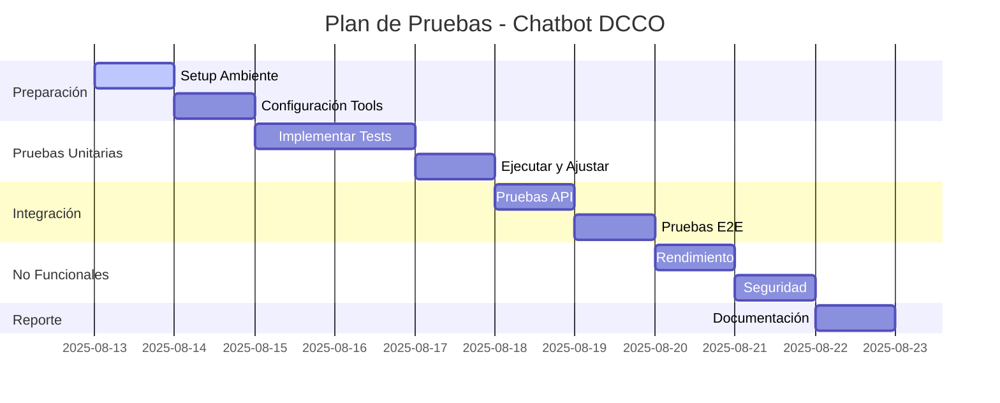

# Plan de Pruebas - Chatbot API DCCO/ESPE
## Proyecto de Aseguramiento de Calidad de Software

**Versión:** 1.0  
**Fecha:** 12 de Agosto de 2025  
**Autor:** [Tu Nombre]  
**Proyecto:** Sistema de Chatbot Académico DCCO/ESPE  

---

## 📋 Índice

1. [Resumen Ejecutivo](#1-resumen-ejecutivo)
2. [Alcance del Plan](#2-alcance-del-plan)
3. [Estrategia de Pruebas](#3-estrategia-de-pruebas)
4. [Tipos de Pruebas](#4-tipos-de-pruebas)
5. [Herramientas y Tecnologías](#5-herramientas-y-tecnologías)
6. [Criterios de Entrada y Salida](#6-criterios-de-entrada-y-salida)
7. [Plan de Ejecución](#7-plan-de-ejecución)
8. [Gestión de Defectos](#8-gestión-de-defectos)
9. [Métricas y Reportes](#9-métricas-y-reportes)
10. [Cronograma](#10-cronograma)

---

## 1. Resumen Ejecutivo

### 1.1 Propósito
Este plan define la estrategia integral de pruebas para el sistema de Chatbot Académico del Departamento de Ciencias de la Computación (DCCO) de la Universidad ESPE, garantizando la calidad, funcionalidad y rendimiento del sistema antes de su despliegue en producción.

### 1.2 Objetivos de Calidad
- **Funcionalidad:** 95% de respuestas correctas para preguntas académicas válidas
- **Rendimiento:** Tiempo de respuesta < 3 segundos para el 95% de consultas
- **Disponibilidad:** 99.5% de uptime del sistema
- **Seguridad:** 0 vulnerabilidades críticas o altas
- **Cobertura de Código:** Mínimo 80% de cobertura en pruebas unitarias

### 1.3 Arquitectura del Sistema
```
┌─────────────────┐    ┌─────────────────┐    ┌─────────────────┐
│   Frontend      │────│   Django API    │────│   Firebase      │
│   (React/Web)   │    │   (ChatbotAPI)  │    │   (RAG System)  │
└─────────────────┘    └─────────────────┘    └─────────────────┘
                              │
                       ┌─────────────────┐
                       │   OpenAI GPT    │
                       │   (Reformulado) │
                       └─────────────────┘
```

---

## 2. Alcance del Plan

### 2.1 Componentes Incluidos
- ✅ **API REST Django** (chatbot/views.py)
- ✅ **Sistema RAG Firebase** (firebase_embeddings.py)
- ✅ **Integración OpenAI** (consultar_llm_inteligente)
- ✅ **Búsqueda Vectorial** (vector_store.py)
- ✅ **Endpoints de Gestión** (FAQManagementAPIView)
- ✅ **Autenticación y Autorización** (authentication.py)

### 2.2 Componentes Excluidos
- ❌ Frontend/UI (fuera del alcance del backend)
- ❌ Infraestructura de servidores (responsabilidad de DevOps)
- ❌ Migración de datos históricos

### 2.3 Ambiente de Pruebas
- **Desarrollo:** http://localhost:8000/
- **Staging:** http://74.235.218.90:8000/
- **Producción:** [Por definir]

---

## 3. Estrategia de Pruebas

### 3.1 Enfoque de Testing
**Estrategia:** Testing en Pirámide + Testing Basado en Riesgos

```
                    ┌─────────────┐
                    │     E2E     │  (20%)
                    │  (Selenium) │
                ┌───┼─────────────┼───┐
                │   │ Integration │   │  (30%)
                │   │  (Django)   │   │
            ┌───┼───┼─────────────┼───┼───┐
            │   │   │    Unit     │   │   │  (50%)
            │   │   │  (pytest)   │   │   │
            └───┴───┴─────────────┴───┴───┘
```

### 3.2 Metodología
- **Test-First Development:** Escribir pruebas antes del código
- **Continuous Integration:** Ejecución automática en cada commit
- **Risk-Based Testing:** Priorizar componentes críticos

### 3.3 Criterios de Calidad
- **Funcional:** Todas las funcionalidades principales funcionan
- **No Funcional:** Rendimiento, seguridad y usabilidad aceptables
- **Regresión:** Nuevos cambios no rompen funcionalidad existente

---

## 4. Tipos de Pruebas

### 4.1 Pruebas Funcionales

#### 4.1.1 Pruebas Unitarias (50% del esfuerzo)
**Herramientas:** pytest, unittest  
**Cobertura Objetivo:** 80%  

**Componentes a Probar:**
- `chatbot/views.py` - Lógica del chatbot
- `firebase_embeddings.py` - Sistema RAG
- `vector_store.py` - Búsqueda vectorial
- `authentication.py` - Autenticación
- `firebase_service.py` - Gestión Firebase

**Casos de Prueba:**
```python
def test_consultar_openai_success()
def test_firebase_rag_integration()
def test_vector_search_similarity()
def test_academic_question_validation()
def test_context_filtering()
```

#### 4.1.2 Pruebas de Integración (30% del esfuerzo)
**Herramientas:** Django TestCase, requests  

**Escenarios:**
- API + Firebase RAG
- API + OpenAI GPT
- API + Vector Store
- Sistema completo end-to-end

#### 4.1.3 Pruebas de API REST (20% del esfuerzo)
**Herramientas:** Postman, curl, requests  

**Endpoints a Probar:**
- `POST /chatbot/` - Consulta principal
- `POST /faq/manage/` - Gestión FAQs
- `GET /firebase/status/` - Estado del sistema
- `POST /faq/check-duplicate/` - Validación duplicados

### 4.2 Pruebas No Funcionales

#### 4.2.1 Pruebas de Rendimiento
**Herramientas:** Apache JMeter, LoadRunner, wrk  

**Métricas:**
- Tiempo de respuesta promedio < 3s
- Throughput > 100 requests/minuto
- Uso de memoria < 512MB
- CPU utilization < 70%

#### 4.2.2 Pruebas de Seguridad
**Herramientas:** OWASP ZAP, Bandit, Safety  

**Verificaciones:**
- Inyección SQL/NoSQL
- Cross-Site Scripting (XSS)
- Autenticación y autorización
- Validación de entrada
- Exposición de datos sensibles

#### 4.2.3 Pruebas de Usabilidad
**Herramientas:** Manual Testing, User Stories  

**Criterios:**
- Respuestas claras y útiles
- Tiempo de respuesta aceptable
- Manejo de errores amigable

### 4.3 Pruebas Especializadas

#### 4.3.1 Pruebas de IA/ML
**Componente:** Reformulación OpenAI + Firebase RAG  

**Casos de Prueba:**
- Precisión de respuestas académicas
- Detección de contexto correcto
- Reformulación de respuestas
- Manejo de preguntas fuera de contexto

#### 4.3.2 Pruebas de Calidad de Código
**Herramientas:** pylint, flake8, black, mypy  

**Métricas:**
- Pylint score > 8.0/10
- 0 errores críticos de flake8
- Cumplimiento PEP 8
- Type hints coverage > 70%

---

## 5. Herramientas y Tecnologías

### 5.1 Framework de Testing
```bash
# Instalación de herramientas
pip install pytest pytest-django pytest-cov
pip install requests responses
pip install factory-boy faker
pip install pylint flake8 black mypy
pip install bandit safety
```

### 5.2 Herramientas por Categoría

#### Pruebas Unitarias e Integración
- **pytest** - Framework principal
- **Django TestCase** - Pruebas de Django
- **factory-boy** - Generación de datos de prueba
- **responses** - Mock de APIs externas

#### Calidad de Código
- **pylint** - Análisis estático
- **flake8** - Linting PEP 8
- **black** - Formateo automático
- **mypy** - Type checking

#### Seguridad
- **bandit** - Análisis de seguridad
- **safety** - Vulnerabilidades en dependencias
- **OWASP ZAP** - Pruebas de penetración

#### Rendimiento
- **Apache JMeter** - Load testing
- **cProfile** - Profiling de Python
- **Django Debug Toolbar** - Análisis de queries

### 5.3 CI/CD Integration
```yaml
# .github/workflows/tests.yml
name: Tests
on: [push, pull_request]
jobs:
  test:
    runs-on: ubuntu-latest
    steps:
      - uses: actions/checkout@v2
      - name: Set up Python
        uses: actions/setup-python@v2
      - name: Install dependencies
        run: pip install -r requirements.txt
      - name: Run tests
        run: |
          pytest --cov=chatbot
          pylint chatbot/
          flake8 chatbot/
          bandit -r chatbot/
```

---

## 6. Criterios de Entrada y Salida

### 6.1 Criterios de Entrada
**Para iniciar las pruebas, se debe cumplir:**
- ✅ Código fuente estable en repositorio
- ✅ Ambiente de pruebas configurado
- ✅ Base de datos de pruebas disponible
- ✅ APIs externas (OpenAI, Firebase) accesibles
- ✅ Herramientas de testing instaladas

### 6.2 Criterios de Salida
**Para completar las pruebas, se debe lograr:**
- ✅ 100% de casos de prueba ejecutados
- ✅ 95% de casos de prueba pasando
- ✅ 80% de cobertura de código
- ✅ 0 defectos críticos abiertos
- ✅ Pylint score > 8.0
- ✅ 0 vulnerabilidades de seguridad altas/críticas

---

## 7. Plan de Ejecución

### 7.1 Fases de Testing

#### Fase 1: Setup y Preparación (1 día)
- Configuración de ambiente de pruebas
- Instalación de herramientas
- Configuración de datos de prueba

#### Fase 2: Pruebas Unitarias (3 días)
- Implementación de pruebas unitarias
- Ejecución y ajustes
- Reporte de cobertura

#### Fase 3: Pruebas de Integración (2 días)
- Pruebas de API endpoints
- Integración con servicios externos
- Pruebas de flujo completo

#### Fase 4: Pruebas No Funcionales (2 días)
- Pruebas de rendimiento
- Análisis de seguridad
- Pruebas de calidad de código

#### Fase 5: Reporte y Documentación (1 día)
- Consolidación de resultados
- Reporte ejecutivo
- Recomendaciones

### 7.2 Cronograma Detallado

| Día | Actividades | Entregables |
|-----|-------------|-------------|
| 1 | Setup inicial, configuración | Ambiente listo |
| 2-4 | Pruebas unitarias | 80% cobertura |
| 5-6 | Pruebas de integración | APIs validadas |
| 7-8 | Pruebas no funcionales | Métricas de calidad |
| 9 | Reporte final | Documento QA |

---

## 8. Gestión de Defectos

### 8.1 Clasificación de Severidad

#### Crítica (P1)
- Sistema no funciona
- Pérdida de datos
- Vulnerabilidades de seguridad críticas

#### Alta (P2)
- Funcionalidad principal no trabaja
- Rendimiento inaceptable
- Errores de lógica importantes

#### Media (P3)
- Funcionalidad secundaria afectada
- Problemas de usabilidad
- Inconsistencias menores

#### Baja (P4)
- Problemas cosméticos
- Mejoras de código
- Documentación

### 8.2 Proceso de Gestión
1. **Detección** → Identificación durante pruebas
2. **Registro** → Documentación en sistema de tracking
3. **Triaje** → Asignación de prioridad y responsable
4. **Resolución** → Desarrollo de fix
5. **Verificación** → Re-testing del defecto
6. **Cierre** → Confirmación de resolución

---

## 9. Métricas y Reportes

### 9.1 Métricas de Pruebas

#### Cobertura de Código
```bash
pytest --cov=chatbot --cov-report=html
```
- **Objetivo:** 80% cobertura mínima
- **Crítico:** Cubrir funciones principales del chatbot

#### Calidad de Código
```bash
pylint chatbot/ --score=yes
```
- **Objetivo:** Score > 8.0/10
- **Métricas:** Errores, warnings, convenciones

#### Rendimiento
- **Tiempo de respuesta:** < 3 segundos (95%)
- **Throughput:** > 100 requests/minuto
- **Memoria:** < 512MB uso promedio

### 9.2 Dashboards de Calidad

#### Dashboard Principal
```
┌─────────────────────────────────────────────────────┐
│ DASHBOARD DE CALIDAD - CHATBOT DCCO                │
├─────────────────────────────────────────────────────┤
│ Cobertura de Código:        [████████░░] 82%       │
│ Pylint Score:               [█████████░] 8.7/10    │
│ Pruebas Pasando:            [██████████] 98%       │
│ Vulnerabilidades:           [██████████] 0 Críticas│
│ Tiempo Respuesta Promedio:  [████████░░] 2.1s      │
└─────────────────────────────────────────────────────┘
```

### 9.3 Reportes Automáticos

#### Reporte Diario
- Estado de build
- Pruebas ejecutadas/fallidas
- Nuevos defectos encontrados
- Métricas de rendimiento

#### Reporte Semanal
- Tendencias de calidad
- Análisis de defectos
- Recomendaciones de mejora
- Plan para próxima semana

---

## 10. Cronograma

### 10.1 Timeline de Ejecución



### 10.2 Hitos Importantes

| Fecha | Hito | Criterio de Aceptación |
|-------|------|------------------------|
| 13/08 | Setup Completo | Ambiente funcionando |
| 15/08 | Pruebas Unitarias | 80% cobertura lograda |
| 17/08 | Integración Lista | APIs validadas |
| 19/08 | Testing Completo | Todas las pruebas ejecutadas |
| 20/08 | Reporte Final | Documento entregado |

---

## 11. Recursos y Responsabilidades

### 11.1 Equipo de Testing
- **QA Lead:** Coordinación y estrategia
- **QA Engineer:** Ejecución de pruebas
- **Developer:** Soporte técnico y fixes
- **DevOps:** Configuración de ambientes

### 11.2 Recursos Necesarios
- **Hardware:** Servidor de pruebas (4GB RAM, 2 CPU)
- **Software:** Herramientas de testing y licencias
- **Tiempo:** 9 días persona para ejecución completa
- **Presupuesto:** Servicios cloud para testing

---

## 12. Riesgos y Mitigaciones

### 12.1 Riesgos Identificados

| Riesgo | Probabilidad | Impacto | Mitigación |
|--------|-------------|---------|------------|
| APIs externas no disponibles | Media | Alto | Mocks y datos de prueba |
| Tiempo insuficiente | Alta | Medio | Priorizar pruebas críticas |
| Recursos limitados | Media | Medio | Automatización máxima |
| Defectos críticos tardíos | Baja | Alto | Testing continuo |

### 12.2 Plan de Contingencia
- **Backup de datos:** Snapshots diarios
- **Rollback plan:** Versión estable anterior
- **Comunicación:** Canal directo con stakeholders
- **Escalación:** Proceso definido para issues críticos

---

## 13. Conclusiones y Próximos Pasos

### 13.1 Valor del Plan
Este plan de pruebas integral garantiza:
- **Calidad robusta** del sistema de chatbot
- **Confianza** en el despliegue a producción
- **Documentación completa** para auditorías
- **Proceso repetible** para futuras versiones

### 13.2 Próximos Pasos
1. **Aprobación** del plan por stakeholders
2. **Setup** del ambiente de pruebas
3. **Implementación** de casos de prueba
4. **Ejecución** según cronograma
5. **Entrega** de reporte final

---

## 14. Anexos

### 14.1 Referencias
- [Django Testing Documentation](https://docs.djangoproject.com/en/stable/topics/testing/)
- [Pytest Documentation](https://docs.pytest.org/)
- [OWASP Testing Guide](https://owasp.org/www-project-web-security-testing-guide/)

### 14.2 Plantillas
- Template de caso de prueba
- Formato de reporte de defecto
- Checklist de calidad

---

**Documento preparado para exposición de Aseguramiento de Calidad de Software**  
**Universidad ESPE - Departamento de Ciencias de la Computación**
